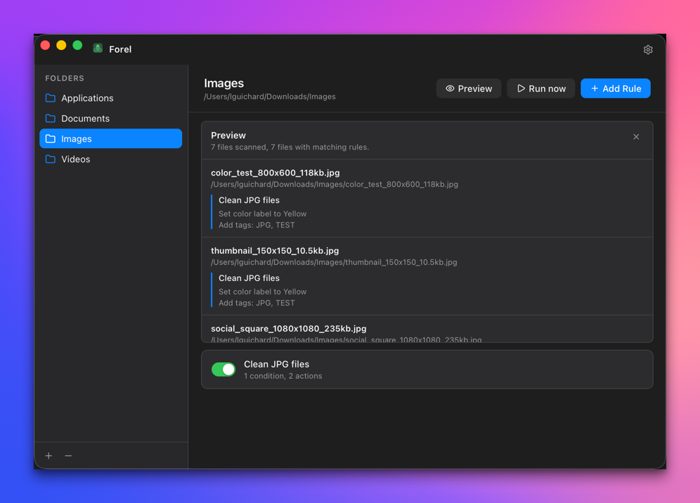
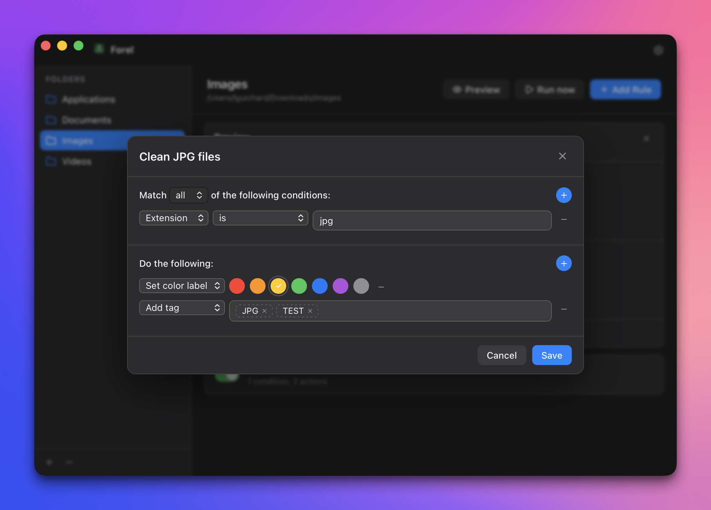

<div align="center">


# Forel

**The Hazel alternative for macOS. Free and open source.**

[](https://www.apple.com/macos/)
[](https://wails.io)
[](https://go.dev)
[](https://react.dev)
[](LICENSE)
[](https://github.com/lguichard/forel/stargazers)
[](https://github.com/lguichard/forel)

[Download](#installation) · [Documentation](docs/) · [Contributing](CONTRIBUTING.md)

<br/>

 

</div>

> [!WARNING]
> Forel is currently in **alpha**. Expect bugs, missing features, and breaking changes between versions. Not recommended for production use yet.

---

> **Free, open source, and 100% on-device.**
> Forel sorts your files by rules you define — they never leave your Mac.

---

## Why Forel

Forel is a free, open-source, community-driven take on folder automation for macOS. Define rules once — watch folders, match files, and move, rename, tag, or label them automatically — then let Forel run quietly in your menu bar.

---

## What Forel does

Forel watches your folders and organizes your files automatically based on rules you define — by filename, extension, size, or date.

```
Downloads/
├── invoice_march_2026.pdf     →  Work/Invoices/2026/
├── photo_2026-03-14.jpg       →  Photos/2026/March/
├── contract_draft_v3.docx     →  Work/Legal/Pending/
└── bank_statement_march.pdf   →  Finance/2026/
```

Set up a rule once. Forel handles the rest — even when the window is closed.

And everything happens **on your Mac**. No cloud. No API keys. No subscription. Your files never leave your machine.

---

## Highlights

- **Free & open source** — no license fee, no subscription, MIT-licensed.
- **100% on-device** — no cloud, no API keys, no account. Your files never leave your Mac.
- **Rule-based** — match by name, extension, kind, size, date, tags, color label, or content.
- **Native menu-bar app** — runs quietly in the background; toggle rules without opening the window.
- **Community-driven** — built in the open, contributions welcome.

---

## Features

- **Rule-based automation** — Create flexible rules combining filename patterns, file types, sizes, and dates.
- **Folder watching** — Monitor any number of folders in real time using `fsnotify` (FSEvents-backed on macOS).
- **Menu bar icon** — Forel lives in your menu bar. Toggle individual rules on/off without opening the main window.
- **Actions** — Move, copy, rename, tag, trash, or run a custom script.
- **Privacy first** — No telemetry, no analytics, no accounts. SQLite database stored locally.

---

## Installation

### Homebrew (coming soon)

```bash
brew install --cask forel
```

### Manual

Download the latest `.dmg` from the [Releases](https://github.com/lguichard/forel/releases) page, open it, and drag Forel to your Applications folder.

### Build from source

**Prerequisites:** [Go 1.24+](https://go.dev/dl/) · [Node.js 20+](https://nodejs.org) · [pnpm](https://pnpm.io) · the [Wails 3 CLI](https://v3.wails.io) (`go install github.com/wailsapp/wails/v3/cmd/wails3@latest`)

```bash
git clone https://github.com/lguichard/forel.git
cd forel
wails3 dev
```

To build a packaged macOS `.app`:

```bash
wails3 task package
```

> Requires macOS 14 Sonoma or later.

---

## Quick Start

1. Launch Forel — the icon appears in your **menu bar**.
2. Click the icon to see active rules, or open the main window.
3. Click **Add Rule** and choose a folder to watch.
4. Define your conditions — by name, extension, size, date, or content.
5. Set an action: move, rename, tag, or run a script.
6. Enable the rule. Forel handles the rest — even when the window is closed.

For a full walkthrough, see the [Getting Started guide](docs/getting-started.md).

---

## Screenshots


---

## Architecture

Forel is built with [Wails 3](https://wails.io): a **Go backend** for system-level work and a **React frontend** for the UI, compiled into a native macOS app.

```
forel/
├── main.go                     # App bootstrap: DB, watcher, window, tray, run loop
├── app.go                      # Bound service — methods exposed to the frontend
├── internal/
│   ├── db/db.go                # SQLite schema & queries (modernc.org/sqlite)
│   ├── tray/                   # macOS menu bar icon & dynamic menu
│   ├── watcher/watcher.go      # File system watcher (fsnotify)
│   └── rules/
│       ├── model.go            # Rule / Condition / Action data models
│       ├── engine.go           # Rule evaluation pipeline
│       ├── condition.go        # Condition matching logic
│       └── action.go           # Action execution (move, rename, tag…)
│
└── frontend/                   # React + TypeScript frontend
    ├── bindings/               # Generated Go↔TS bindings
    └── src/
        ├── components/         # RuleList, RuleEditor, Sidebar
        ├── store/index.ts      # Zustand global state — all binding calls
        └── types/index.ts      # Shared TypeScript types
```

**Key technology choices:**

| Layer | Technology | Why |
|-------|-----------|-----|
| App shell | Wails 3 | Native macOS binary, tiny bundle, no Electron overhead |
| Backend | Go | Simple systems code, fast builds, great stdlib |
| File watching | `fsnotify` (FSEvents) | Low-latency, battery-friendly folder monitoring |
| Database | SQLite via `modernc.org/sqlite` | Pure-Go, no CGO, persists rules across reboots |
| Frontend | React 19 + TypeScript | Familiar web stack, fast iteration |
| State | Zustand | Minimal, no boilerplate |
| Build | Vite 7 + pnpm | Fast HMR during development |

---

## Roadmap

- [x] Folder watching (FSEvents via `fsnotify`)
- [x] Rule engine (name, extension, size, date)
- [x] Actions: move, copy, rename, trash, delete, tag, open with, run script
- [x] SQLite persistence
- [x] macOS menu bar icon with live rule toggle
- [ ] Action history & undo
- [ ] Native notifications on rule actions
- [ ] Activity logs
- [ ] Preferences: launch at login
- [ ] Automatic updates
- [ ] AI features

---

## Contributing

Forel is in early development and contributions are very welcome.

```bash
git clone https://github.com/lguichard/forel.git
cd forel
wails3 dev   # hot-reload frontend + Go backend
```

Please read [CONTRIBUTING.md](CONTRIBUTING.md) before submitting. Bug reports, feature requests, and documentation improvements are all appreciated.

---

## License

MIT — see [LICENSE](LICENSE) for details.

---

<div align="center">

Made with ☕ · Wails + Go + React · Inspired by file automation workflows popularized by tools like Hazel.

</div>
